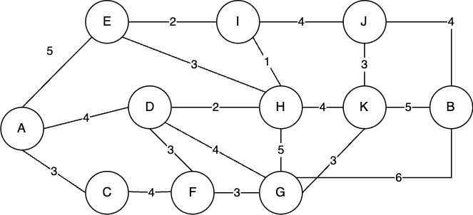
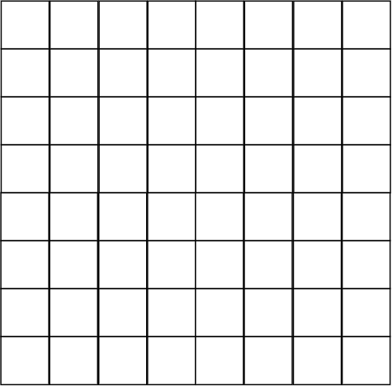
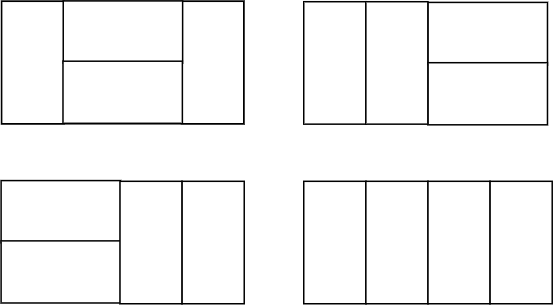

# Fáciles

## 1. Grandes inversiones

Te has convertido en una persona de las altas finanzas, todo porque quieres comprarte un nuevo celular. Tu primera opción era ahorrar $1,000$ mes a mes hasta conseguir la cantidad suficiente para comprar el teléfono. Pero decidiste ser más inteligente e invertir tu dinero.

La inversión que elegiste es un poco secreta porque te ofrece el grandioso retorno de un $10\%$ **mensual** (sospechoso, pero funciona). Tú vas a invertir $1,000$ y todos los meses, esos $1,000$ te estarán dando otros $100$ cada mes subsecuente.

Entonces, el primer mes tendrás $1,000$ ahorrados. El segundo mes tendrás $2,100$, el siguiente $3,300$, que son los $3,000$ de lo que ahorras cada mes, unos $200$ que te generaron los primeros $1,000$ y otros $100$ que te generaron los $1,000$ del segundo mes. ¿En cuántos meses obtienes la cantidad suficiente para comprar un teléfono de $32,000$?

***Pista:*** Fíjate en cuánto dinero *nuevo* obtienes cada mes y la suma de todos los meses será tu cantidad actual. Después de los primeros 5 meses obtienes:

\begin{align*}
1000 + 1100 + 1200 + 1300 + 1400 &= (1000) + (1000 + 100) + \ldots + (1000 + 400) \\
&= 1000 \times 5 + (100 + 200 + 300 + 400) \\
&= 1000 \times 5 + 100 \times (1 + 2 + 3 + 4) \\
&= 1000 \times 5 + 100 \times \frac{4(4 + 1)}{2} \\
&= 6000.
\end{align*}

Puedes intentar deducir una fórmula y despejarla.

**Respuesta:** 18.

## 2. HOY ES DIA DE PAN

Como todos los miércoles en la oficina, hoy es día de pan. Todo el mundo quiere tomar un pan de la cocina; sin embargo, no todos alcanzan. Desconoces la cantidad de panes que pusieron originalmente, pero sabes que las personas son muy honradas y cada una toma solo un pan. Además, un total de 100 personas intentaron ir por pan y algunos no alcanzaron.

Tú estuviste muy pendiente de la entrada y salida de las personas y sabes en qué orden entraron las 100 personas a buscar pan. Puedes ir con cada persona y preguntarle "¿alcanzaste pan?" y las personas te responderán sí o no. ¿Cuál es el máximo número de preguntas que deberás hacer para conocer cuántos panes había originalmente en la cocina?

***Pista:*** Imagina que le preguntas a la persona 40 si alcanzó un pan. Si la respuesta es afirmativa, sabes que las primeras 40 obtuvieron pan, por lo que ya no es necesario preguntarles. Por otro lado, si la respuesta es negativa, sabes que las últimas 60 no obtuvieron pan. Intenta idear una estrategia donde tengas que hacer la mínima cantidad de preguntas y calcula en el peor de los casos cuántas preguntas necesitas hacer.

**Respuesta:** 7.

## 3. Sumando de dígitos

Un día te encontrabas muy aburrido esperando a que terminaran de correr tus tests y querías ponerle un desafío a tu compañero. Escribiste todos los números del $6,150$ al $74,562$ en una hoja y le preguntaste a tu compañero cuál es la suma de todos estos números.

Sin embargo, digamos que no eres la mejor persona en caligrafía y todos tus números se encuentran muy pegados. Entonces, en lugar de sumar cada uno de los números, tu amigo sumó todos los dígitos que vio en la libreta. ¿Cuál es el resultado de esa suma?

***Pista:*** Puedes intentar hacer la suma por unidades. Por ejemplo, ¿cuánto suman todas las unidades? Sabes que se repiten de la forma $0, 1, 2, 3, 4, 5, 6, 7, 8, 9$ cada $10$ números. Puedes contar cuántos de esos ciclos hay en las unidades y multiplicarlo por la suma de los números del $0$ al $9$. Si la pregunta fuera del $20$ al $100$, sabes que este ciclo se repite $8$ veces. Entonces, *únicamente las unidades* suman $8 \times (1 + ... + 9)$.

**Solución:** 1,472,274.

## 4. Camino mínimo

El siguiente mapa muestra las conexiones del transporte público de cierta ciudad, así como el tiempo que toma llegar de un punto a otro.

Suponiendo que apenas llegas a un punto puedes tomar cualquier ruta (no hay tiempo de espera en una parada). Determina el tiempo mínimo para llegar del punto A al punto B.

***Pista:*** Intenta calcular el camino más corto hacia cada uno de los nodos. Ten en cuenta que el camino más corto de $A$ a $J$, por ejemplo, tiene que ser uno que necesariamente pasa por el nodo $I$ o el $K$. Entonces, si puedes ir calculando los caminos cortos en cierto orden, puedes llegar a la solución.

**Solución:** 14.

## 5. Vueltas por el piso 7

¡Te has propuesto darle una vuelta completa al piso 7 de la oficina! La vuelta que vas a dar es un poco especial; podemos numerar los cuadros del piso del $1$ al $2024$, después del cuadro $2024$ está el $1$. Vas a empezar en el cuadro $1$, lo vas a marcar y darás brincos de $12$ en $12$, marcando cada lugar por el que pasas. Como te sueles perder mucho en los pisos, únicamente dejarás de saltar hasta que te encuentres en un lugar que ya marcaste antes.

¿Cuántos brincos vas a dar hasta parar?

***Pista:*** El primer cuadro por el que vas a pasar que ya visitaste es el $1$, porque, para llegar a cualquier otro que ya pasaste, primero tienes que ir por ese $1$. 

En la primera vuelta te vas a quedar en el $2017$ y luego darás un brinco hacia el $5$. Si calculas inicios, fines y cuántos cuadros pasas por cada vuelta, puedes llegar a la solución.

Igual existe un acercamiento más matemático. Imagina que el problema no es circular, es decir, después del $2024$ sigue el $2025$. Entonces, te vas a detener cuando pases por un número que sea múltiplo de $2025$.

**Solución**: 506.

## 6. Equipos de Ultimate Frisbee

Hoy decidiste unirte al club de *ultimate frisbee*. En este juego, las personas se dividen en dos equipos. Este es un día especial, entonces, cambiaron la dinámica de cómo se forman los grupos a la siguiente.

Todos se sientan en un círculo y empiezan por una persona al azar. Esta persona pasa a formar parte del equipo $1$, luego, la que está $2$ personas a la derecha pasa a formar parte del segundo equipo, la que está dos a la derecha de esa es del equipo $1$, y así sucesivamente. Hoy vinieron únicamente $10$. Numeras las personas del $1$ al $10$, donde el $1$ es el primero en ser elegido. Entonces, el orden en el que las personas se van eligiendo sería $[1, 3, 5, 7, 9, 2, 6, 10, 8, 4]$.

Así que, si quieres evitarte la pena de ser el último elegido, solo tienes que evitar ser el número $4$ en el círculo. En eso te preguntaste, Oracle tiene alrededor de $135,000$ empleados en todo el mundo. Si hiciéramos una partida de *ultimate* masiva con todos en la empresa, ¿quién sería el último en ser elegido?

***Pista:*** En problemas de algoritmos, algo que se usa mucho es reducir el problema a uno similar pero más pequeño y utilizar su solución para dar con la solución del problema más grande.

Imagina que tenemos $20$ personas. Sabemos que los primeros eliminados son los números impares. Ahora nos van a quedar los pares $[2, 4, ..., 20]$. Podemos utilizar una operación de reindexación, que no es más que asociar cada número par a un número natural mediante una operación. La quinta persona de los que nos quedan es el $2 \times 5 = 10$. Muy bien, ahora tenemos el mismo problema pero más pequeño: tenemos $10$ personas y queremos saber cuál es el último en ser elegido.

En el ejemplo, se muestra que cuando tenemos $10$ personas, el último en ser elegido es el $4$. Entonces, de los que nos quedan por elegir, sabemos que la $4$ta persona será la última en ser elegida, en este caso la $4$ta persona que nos queda es el $2 \times 4 = 8$. La idea es aplicar esta reducción hasta obtener un caso suficientemente pequeño e ir construyendo la solución.

**Respuesta:** 7,856.

## 7. Contando cuadrados

¿Cuántos cuadrados hay en la siguiente figura?

***Pista:*** Puedes ir contando por tamaño, cuántos hay de $1 \times 1$, cuántos de $2 \times 2$, ..., hasta de $8 \times 8$. Además, para saber cuántos cuadrados de $k \times k$ hay, puedes ver cuántos hay por cada altura y multiplicarlo por cuántos hay en el ancho; esto es una aplicación del principio multiplicativo, que es una técnica básica de conteo.

**Respuesta:** 204.

## 8. Diseñando el nuevo Data Center

Estás trabajando en el diseño de un nuevo Data Center en México especializado en IA (necesitamos muchas GPUs). Dentro de él se pueden poner servidores con diferentes capacidades. Actualmente tenemos servidores con:

- 1 GB
- 5 GB
- 13 GB
- 19 GB
- 23 GB
- 28 GB

Se quiere que el centro pueda servir exactamente $130$ GB. Como el espacio es reducido, ayuda a determinar la cantidad mínima de servidores que se necesitan poner.

***Pista:*** Aquí te va una tabla que te puede ser de utilidad:

| Cantidad a servir | Mínimo número de servidores |
| --- | --- |
| 96  | 5   |
| 97  | 4   |
| 98  | 4   |
| 99  | 5   |
| 100 | 5   |
| 101 | 5   |
| 102 | 4   |
| 103 | 4   |
| 104 | 5   |
| 105 | 5   |
| 106 | 5   |
| 107 | 4   |
| 108 | 5   |
| 109 | 6   |
| 110 | 5   |
| 111 | 5   |
| 112 | 4   |
| 113 | 5   |
| 114 | 6   |
| 115 | 5   |
| 116 | 5   |
| 117 | 5   |
| 118 | 6   |
| 119 | 6   |
| 120 | 5   |
| 121 | 5   |
| 122 | 5   |
| 123 | 6   |
| 124 | 6   |
| 125 | 5   |

No es que haya un patrón en los números, pero intenta con esta información deducir los siguientes.

**Solución:** 5.

# Medio

## 1. Replicando información

Digamos que tienes $123,456$ servidores. Tienes información importante que quieres enviar del servidor $1$ hacia todos los demás. Pero solo puedes enviar información de un servidor a otro al mismo tiempo. El envío de información de un servidor a otro tarda $5$ minutos. Luego de eso, el servidor que envió información necesita $1$ minuto de *cooldown* en el que no puede enviar información. ¿Cuál es el mínimo de tiempo que necesitas para pasar la información del servidor $1$ a todos los demás? (cantidad de minutos)

***Pista:*** Programar es una parte importante de resolver problemas de algoritmos. Quizá para este problema hacer un código sencillo te sea de mucha ayuda.

La parte clave de este problema es que cuando una computadora recibe la información, esta puede ir pasando la información a computadoras nuevas. Llamemos $I(t)$ a las computadoras que reciben por primera vez la información en el tiempo $t$. No es difícil llegar a la siguiente fórmula:

$$
I(t) = I(t-5) + I(t-11) + I(t-17) + ...
$$

Recordemos que las de hace $5$ minutos apenas recibieron la información y la pasan en esos $5$ minutos. Luego, las que ya llevan más tiempo necesitan $6$ minutos adicionales por el *cooldown* y el nuevo envío de información. Ahora, puedes intentar generar un código que determine cuándo hay cierta cantidad de computadoras con una información.

**Respuesta:** 96.

## 2. Fichas de dominó

Te has unido al club de juegos de mesa y quisiste llevar un juego nuevo, sorprendente y que nadie jamás haya visto: "Dominó". Después de jugarlo un rato, era momento de guardarlo. Te percataste de que la caja tiene el tamaño exacto para todas las fichas. Esta es una caja de $2 \text{cm} \times 20 \text{cm}$ y cada ficha es de $1 \text{cm} \times 2 \text{cm}$. Te das cuenta de que puedes poner las fichas ya sea en horizontal o vertical y te preguntaste: ¿De cuántas formas **distintas** puedes acomodar las fichas en la caja?

En la siguiente imagen se muestra *algunas* formas de acomodar $4$ fichas de forma distinta.

***Pista:*** Intenta construir tu solución desde el inicio. ¿Cómo llenarías las primeras casillas? Realmente solo tienes dos opciones: poner una ficha en vertical o ponerla en horizontal. En cada una de las opciones, ¿en qué se convierte tu problema? Luego, tu respuesta solo se va a convertir en sumar la cantidad de formas cuando pusiste la primera en vertical o en horizontal.

**Solución:** 10,946.

## 3. Páginas mal indexadas

Acabas de crear una página web con $83,378,221$ pestañas. Sin embargo, como buen programador te olvidaste de hacer todos los `testings` necesarios. Ahora tienes un `bug` donde la página de cada pestaña la tienes como una cadena de caracteres. ¿Cuál es el problema? Te preguntarás: cuando ordenaste las pestañas, se ordenaron en orden lexicográfico.

Un ordenamiento lexicográfico en palabras quiere decir que se revisa el primer carácter distinto de cada palabra (de izquierda a derecha) y se compara el primero donde difieren; el que va primero en el alfabeto se considera menor. Por ejemplo, si tenemos la palabra `BANDERA` y `BANDIDO`, el primer carácter donde difieren es donde `BANDERA` tiene la `E` y `BANDIDO` la `I`; en este caso, como la `E` va antes en el alfabeto, pues esa es menor. De igual forma, un prefijo siempre es menor a la palabra, es decir, `PARA` va antes que `PARAGUAS`. Es el mismo orden que usa un diccionario.

El problema es que si haces eso en los números tienes cosas como que el `1812` va primero que el `20`. Entonces, tus pestañas se encuentran en el orden $1, 10, 100, ..., 11, 110, ...$. Si te vas justo a la mitad de las pestañas, ¿qué pestaña encontrarías? Es decir, ¿qué pestaña está en la posición $41,689,111$?

***Pista:*** Sabemos que los primeros elementos son aquellos que empiezan con el $1$. ¿Cuántos números hay que empiezan con el $1$? $1$ de la unidad, $10$ cuando está en las decenas, $100$ cuando está en las centenas, etc. En total hay $10,000,000 + 1,000,000 + ... + 10 + 1 = 11,111,111$ números que empiezan con el $1$. Entonces, el elemento en la mitad no puede empezar por el $1$.

Luego, hay otros $11,111,111$ que empiezan por el $2$, por lo tanto, los primeros $22,222,222$ números empiezan por un número menor o igual al $2$. Podemos seguir esta lógica y darnos cuenta de que los números entre el $33,333,334$ y el $44,444,444$ empiezan con el $4$. Por lo tanto, el número que estamos buscando empieza con el $4$. Intenta deducir los demás números.

**Solución:** 47,520,196. 

## 4. Colisiones en el hash

Convertir una palabra en un número es una parte esencial de la programación, en especial para temas de optimización de búsqueda o incluso en criptografía. El proceso de convertir una palabra a un número se le llama hacer un hash. Un hash bastante común se basa en hacer una base numérica de $27$ con los números, dándole a cada letra un valor correspondiente a su posición en el alfabeto. Es decir, $A = 1, B = 2, ..., Z = 26$ (estamos manejando el alfabeto inglés). Y con eso hacemos una conversión de base.

Por ejemplo, digamos que tenemos la palabra `DATA`, entonces, la primera letra (de derecha a izquierda) se multiplica por $27^0$, la siguiente por $27^1$ y así sucesivamente y al final la suma de los valores da el hash de la palabra.

$$
hash(DATA) = 4 \times 27^3 + 1 \times 27^2 + 20 \times 27^1 + 1 \times 27^0 = 80002
$$

Sin embargo, como los números suelen ser muy grandes, al resultado se le hace módulo de algún otro número. Para este problema usaremos módulo $10^4$, que en esencia implica quedarse con los últimos 4 dígitos. Eso dejaría que el hash de `DATA` es $2$. Esto implica que hay _colisiones_, es decir, palabras con el mismo número en el hash. Por ejemplo, `ANDE` tiene un hash de 

$$
hash(ANDE) = \left(27^3 + 14 \times 27^2 + 4 \times 27 + 5 \right) \mod 10^4 = 30002 \mod 10^4 = 2. 
$$

La pregunta es ¿cuántas palabras hay de $4$ letras, que tengan el mismo hash que la palabra `MAPA`?

***Pista:*** Primero decifra el hash de `MAPA`. Ahora, las palabras de cuatro letras tienen un hash inicial (antes del modulo) entre $27^3$ y $27^4 - 1$. Esto quiere decir que estan en el rango del $19,683$ al $531,440$.

Dentro de ese rango solo hay unos pocos numeros que pueden hacer colision con nnuestra palabra original. Unicamente debemos tener cuidado con revisar que numero si coinciden con una palabra, por ejemplo, el numero $27$ no coincide con ninguna palabra. Para esto puedes crear un programa sencillo.

**Respuesta:** 43.

# Difícil

## 1. Binarios palíndromos

Para las ciencias de la computación, los números binarios son esenciales. Los números binarios representan un número como potencias de $2$. Por ejemplo, $19 = 16 + 2 + 1 = 2^4 + 2^1 + 2^0$. Normalmente, se escribe como una cadena de `1`s y `0`s empezando por un `1`. Cada posición representa si la potencia de $2$ está presente o no. $19 = (10011)_2 = 1 \times 2^4 + 0 \times 2^3 + 0 \times 2^2 + 1 \times 2^1 + 1 \times 2^0$.

Hay números curiosos, por ejemplo, el $21 = (10101)_2$. Su cadena en binario se lee igual de derecha a izquierda que de izquierda a derecha. Este tipo de números se les llama *binarios palíndromos*.

Tu tarea en este reto es determinar la cantidad de números *binarios palíndromos* del $987,654,321$ al $123,456,789,012,345,678$.

***Pista:*** Intenta calcular cuántos binarios palíndromos hay de $1$ hasta $X$. Para esto, es conveniente saber dos cosas:

1. Cuántos binarios palíndromos hay con $A$ como el bit más significativo. Es decir, imagina que tienes algo como `1XXXXXX`, sabes que, por ser palíndromo, debe ser algo como `1XXXXX1`. Ahora, aplica una fórmula para contar la cantidad de palíndromos de esa forma.

2. Si tienes algo como $N = (10110011)_2$. Sabes que todos los números de la forma `0XXXXXXX` son menores; puedes usar el punto 1 para calcular cuántos son. Ahora te faltan los palíndromos que son de la forma `1XXXXXX1`. Sabes que la siguiente posición debe ser $0$; si no, se vuelve mayor. Pasas a buscar palíndromos de la forma `10XXXX01`. Luego, si pones un `0`, el número se vuelve menor y puedes contar fácilmente los palíndromos de esa forma. Luego, sigues analizando qué pasa si en vez del `0` pones un `1` y sigues contando hasta contar todos los palíndromos.

**Respuesta:** 728,284,925.

## 2. Número con divisores

Cada número cuenta con cierta cantidad de divisores, es decir, números que lo dividen. Por ejemplo, el $10$ tiene $4$ divisores, que son $1, 2, 5, 10$.

Tu tarea en este problema será determinar el número más pequeño que tiene $4,096$ divisores.

***Pista:*** Si representamos un número como la multiplicación de sus números primos, podemos saber la cantidad de divisores que tiene. Por ejemplo,

$$
120 = 2^3 \times 3 \times 5.
$$

Tiene $4 \times 2 \times 2 = 16$ divisores. Esto es una aplicación del principio multiplicativo y algo de teoría de números. Solo tienes que multiplicar los exponentes de los primos más $1$, en ese caso era $(3+1) \times (1 + 1) \times (1 + 1)$. 

Para este problema, queremos aplicar esto a la inversa, buscando números que multiplicados nos den $4096$:

$$
(a_1 + 1) \times (a_2 + 1) \times \ldots \times (a_k + 1) = 4096.
$$

Una vez conozcamos esos números, podemos hallar la respuesta como:

$$
2^{a_1} \times 3^{a_2} \times \ldots \times p_k^{a_k}.
$$

Hay muchas formas de factorizar $4096$ y muchas posibles elecciones de nuestras $a_i$. Pero el hecho de que sea una potencia de $2$ ($2^{12}$) permite encontrar la respuesta de forma óptima con un programa.

**Respuesta:** 128,501,493,120.